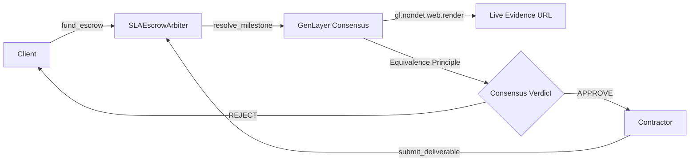

# SLAEscrowArbiter

[](https://sla-escrow-arbiter-one.vercel.app/)
[](https://studio.genlayer.com)
[](https://opensource.org/licenses/MIT)

**SLAEscrowArbiter** is an Intelligent Contract protocol built for GenLayer that automates milestone and SLA escrow settlement. It replaces centralized dispute middlemen with decentralized AI validator consensus over live web evidence (e.g. GitHub repositories, PRs, or API endpoints).

🔗 **Live App**: [https://sla-escrow-arbiter-one.vercel.app/](https://sla-escrow-arbiter-one.vercel.app/)

---

## Why GenLayer?

In decentralized finance and freelance work, judging whether deliverable criteria were met has traditionally required trusted third parties or multisigs. 

SLAEscrowArbiter solves this by:
1. **Holding Native GEN Deposits**: Escrows real value via `@gl.public.write.payable`.
2. **Fetching Real-Time Evidence**: Validators independently render live web evidence via `gl.nondet.web.render`.
3. **Substantive Consensus**: Custom Equivalence Principle validators (`gl.vm.run_nondet_unsafe`) evaluate qualitative satisfaction and agree on both outcome and confidence within strict bounds.
4. **Autonomous Payouts**: Automatically triggers native token transfers (`gl.chain.Account(addr).emit_transfer`) upon consensus.

---

## Architecture Overview



---

## Repository Structure

```
sla-escrow-arbiter/
├── contracts/
│   ├── SLAEscrowArbiter.py    # Core Intelligent Contract
│   └── SLAEscrowFactory.py    # Escrow instance registry
├── tests/
│   └── test_sla_escrow.py     # Comprehensive unit tests
├── scripts/
│   └── deploy.mjs             # Deployment script using genlayer-js
├── docs/
│   ├── ARCHITECTURE.md        # Deep architecture & threat model
│   └── STUDIONET_GUIDE.md     # StudioNet step-by-step instructions
├── pyproject.toml
├── pytest.ini
└── README.md
```

---

## Quickstart & Testing

### Running Tests Locally

```bash
# Install dependencies
pip install pytest

# Run tests
pytest tests/ -v
```

### Deploying on StudioNet

1. Open [GenLayer Studio](https://studio.genlayer.com).
2. Create a file named `SLAEscrowArbiter.py` and paste `contracts/SLAEscrowArbiter.py`.
3. Set contractor address and criteria, then click **Deploy**.
4. Refer to [`docs/STUDIONET_GUIDE.md`](docs/STUDIONET_GUIDE.md) for full interactive testing instructions.

---

## Deployed Contracts (StudioNet)

| Contract | Type | Address | Explorer Link |
| :--- | :--- | :--- | :--- |
| **SLAEscrowFactory** | Registry / Factory | `0x98216F20cb9C01d65fe9671F1C6ee19595F2711B` | [View on Explorer](https://explorer-studio.genlayer.com/address/0x98216F20cb9C01d65fe9671F1C6ee19595F2711B) |
| **SLAEscrowArbiter** | Core Arbiter Instance | `0xEc8245c3B1f002A903BC58357e0b9C707C5fe365` | [View on Explorer](https://explorer-studio.genlayer.com/address/0xEc8245c3B1f002A903BC58357e0b9C707C5fe365) |

---

## License

MIT License. See [LICENSE](LICENSE) for details.
