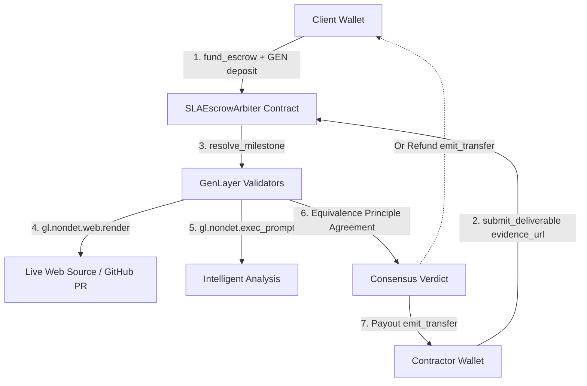

# SLAEscrowArbiter Architecture

## 1. Overview

**SLAEscrowArbiter** is a high-assurance decentralized milestone and SLA escrow protocol built specifically for GenLayer. It allows untrusted counterparties (e.g. Clients and Contractors) to lock native GEN into escrow and settle milestone payments via decentralized, multi-validator AI consensus over live web evidence.

## 2. Trust Model & GenLayer Fit

In traditional smart contracts, escrows suffer from the **Oracle / Subjectivity Dilemma**:
- Smart contracts cannot evaluate whether code in a pull request satisfies human language criteria.
- Centralized arbiters introduce counterparty risk, fees, and operator bias.
- Single-model LLM oracles cannot reach Byzantine fault-tolerant consensus and fail unpredictably.

GenLayer resolves this by executing non-deterministic web fetches and LLM evaluations across multiple independent validator nodes, requiring agreement on substantive verdict and confidence bounds before committing state and releasing escrowed funds.

## 3. Security & GenVM Hygiene Guarantees

1. **Native Value Transfer**: Uses `@gl.public.write.payable` and `gl.chain.Account(addr).emit_transfer(value)` instead of simulated balances.
2. **Substantive Equivalence Principle**: Consensus validates that the independent validators agreed on the outcome (`APPROVE`/`REJECT`) and confidence within a 15% tolerance window, rather than checking format only.
3. **Calldata Safety**: Eliminates bare Python float return types (which crash GenVM) by using integer basis points (`confidence_bps`).
4. **Address Normalization**: Normalizes all addresses to lowercase to prevent EIP-55 casing mismatch rejections.
5. **Consensus-Safe Timestamps**: Uses `gl.message_raw["datetime"]` rather than node local wall clock.
