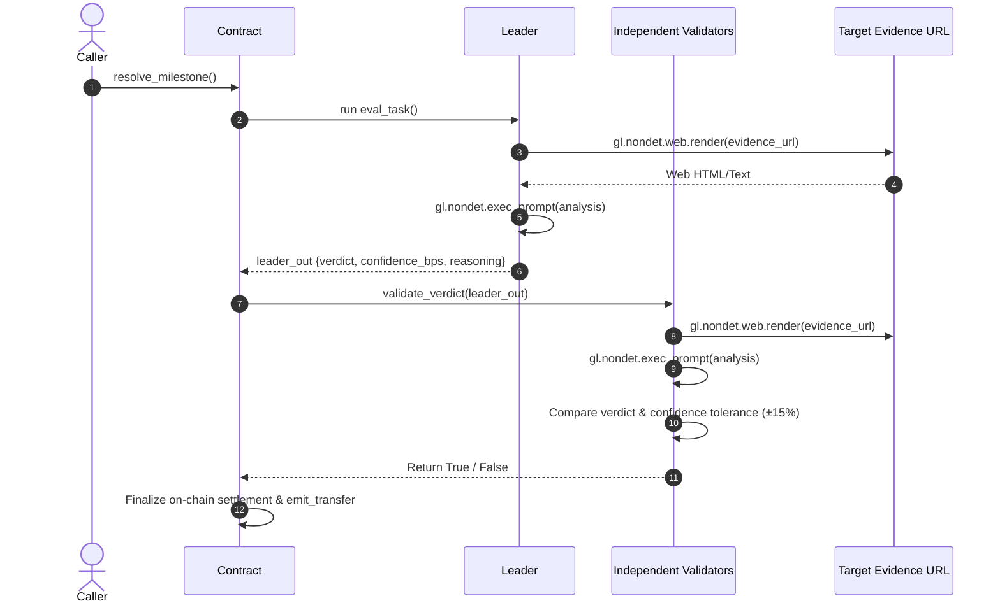

# Consensus & Equivalence Principle Logic

## Overview

The core value proposition of GenLayer is reaching decentralized consensus on subjective, non-deterministic operations. In **SLAEscrowArbiter**, this consensus governs whether a contractor's milestone deliverable meets agreed-upon criteria.

## Leader / Validator Flow (`gl.vm.run_nondet_unsafe`)

## Equivalence Criteria

1. **Exact Verdict Agreement**: Both leader and validator must agree strictly on `"APPROVE"` vs `"REJECT"`.
2. **Confidence Margin**: The validator's calculated `confidence_bps` must be within 1,500 bps (15.00%) of the leader's reported confidence.
3. **Fail-Closed Strategy**: If web fetching fails or outputs cannot be defensively parsed, the verdict falls back to `"REJECT"` with 0 confidence, safeguarding locked funds by defaulting to refund.
